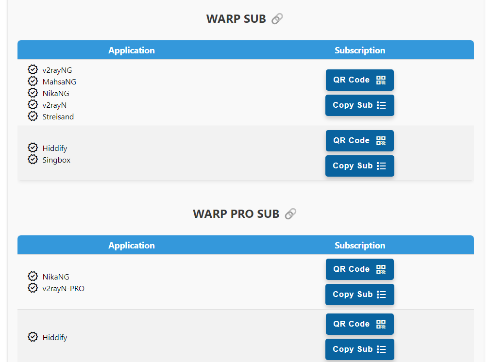
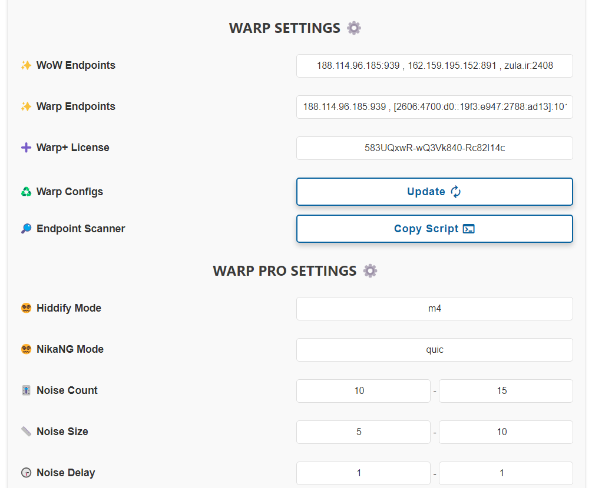

# How to Use

Suppose your worker or page's name is `worker-polished-leaf-d022`:

You can access the Panel by adding `/panel` to the end, like this:

> `https://worker-polished-leaf-d022.workers.dev/panel`

You will be prompted to set a new password and log in, that's all.
> [!IMPORTANT]
> The password must be at least **8 characters long** and include at least one **uppercase letter** and one **number**. You can change the password later from the bottom of the panel.

Now let's go through different sections of the panel:
  

## 1 - Normal Configs

  

We'll start with this section because many can use it without Fragment.

This section provides the subscription link for normal configurations (without Fragment). Depending on your application, copy and use the appropriate link. The Sing-box subscription for iOS and Android is of the **Best Ping** type. It blocks around 90% of Iranian and foreign ads, bypasses Iranian websites (no need to turn off the VPN for payment gateways, etc.), and blocks Phishing, Malware, and similar links.
> [!TIP]
> What is the **Best Ping** config? This config combines all the panel configs and checks every 3 minutes which config has the best speed and connects to it! If you have entered a clean IP, it will also be added to Best Ping. This type of config is available in the Fragment subscription and as a single config for Nekoray, which will be explained later.

This link provides you with 6 configurations. (You can increase the number of configurations from the Clean IP and Port settings). Now, what is the difference between these 6 configs? How can we increase their number? Further explanations and settings are provided [here](#3-5--clean-ip-settings) and [here](#3-6--port-settings).
> [!CAUTION]
> To use these configs, disable Mux in the settings of any application you are using.

> [!WARNING]
> Using this Worker will constantly change your device's IP, so do not use it for tasks such as trading, PayPal, or even websites like Hetzner that are sensitive to IP changes, as there is a possibility of being banned. We have provided two solutions to fix the IP issue: Proxy IP at startup and Proxy Chain, which are explained further [here](#3-2--chain-proxy-settings).
  

## 2 - Fragment Subscription and Configs

> [!NOTE]
> **Advantages of this panel's Fragment configs:**
> 
> 1- Blocking up to 80% of Iranian and foreign ads.
> 
> 2- Bypassing Iranian websites (no need to disconnect the VPN anymore).
> 
> 3- Connecting even if your personal domain or worker is filtered.
> 
> 4- Improved quality and speed on all operators, especially those experiencing issues with Cloudflare.
> 
> 5- Accessing all websites, even those hosted on Cloudflare (older workers had this problem).
 

> [!TIP]
> The WorkerLess config, which doesn't use a worker, unblocks many filtered websites and applications, such as YouTube, Twitter, Google Play, and other blocked websites that cannot be listed here. Please note that this config does not change your IP as it does not use a worker, so it is not suitable for security-sensitive tasks. Changes made to Fragment in the panel also apply to this config, except for Chain Proxy.

> [!TIP]
> The Best Fragment config applies 18 different Fragment values and selects the fastest one based on your operator! These 18 modes are selected to cover all ranges, and the config tests all small and large ranges every minute and connects to the best one.

Below, we will explain how to use these configurations. Advanced settings related to Fragment are also explained [here](#3-1--fragment-settings).
  

### 2-1- Using on Mobile

  

There is a table that provides a subscription for v2rayNG, v2rayN, and Streisand applications. Importing it into the app is the same as a regular subscription.

This subscription provides the same number of configs as the normal subscription, but with Fragment (using the Fragment settings you applied in the panel), plus the **Best Ping** config. Any settings you change in the panel will be applied to all configs when you update the subscription.
> [!CAUTION]
> To avoid problems, v2rayNG version should be at least 1.8.19 and v2rayN version should be at least 6.42.

> [!NOTE]
> Nekobox and Hiddify Next applications do not have these configs because Nekobox does not support Fragment. For Hiddify Next, first, get the configs from the Normal subscription, then from the application's settings, you need to enable Fragment like this:

  

 

### 2-2- Using Fragment on Desktop - Nekoray

  

This section also provides the same Fragment configs for the Nekoray application on Windows and Linux.

Now, how do we import them into the app? First, click on "Copy Config", then in Nekoray:
>1. Right Click
>2. New Profile
>3. type > Custom (xray config)
>4. Paste
   
Note that we also have **Best Ping** here.
  

### 3 - Warp Subscriptions

  

These subscriptions provide a Warp config with an Iranian Cloudflare IP, a Warp on Warp (WoW) config with a foreign IP, and a Warp Best Ping config that connects to the fastest Warp config. By default, there is only one Warp and WoW config, but if you edit the Warp Endpoints and WoW Endpoints sections, more Warp configs will be added according to the number of input endpoints.

Keep in mind to use a scanner to find a suitable Endpoint for your operator. The scanner script is available in the panel, copy it and run it inside Termux on Android. To add it to the panel, refer to section 4-7-1 of Advanced Settings. The regular Warp subscription may work well on some operators like Irancell, but for others, use the Warp Pro subscription.

> [!TIP]
> New developments have been made to the Xray and Singbox cores by GFW-Knocker and the Hiddify team for Warp, resulting in applications like MahsaNG, NikaNG, v2rayN-PRO, and Hiddify, which allow us to optimize Warp connections specifically for Iran, similar to what the Oblivion team is doing. Therefore, I have added the WARP PRO SUB to the panel, which can be customized from the WARP PRO SETTINGS section. Optimal values for each operator are determined empirically, and like Fragment settings, they may vary at different times. However, the default values have been tested and currently work well; you just need to provide a suitable Endpoint.

> Please note that you won't see MahsaNG in this table yet, as we are waiting for it to be updated to the latest core version. Hiddify also needs to be at least version 2.0.5.

  
## 4 - Advanced Settings

### 4-1- Fragment Settings

  

This section is for configuring Fragment configs and has no effect on normal configs.

Fragment configs have several default values that work well on most operators. But now suppose, based on your experience, you have settings that always work better on your operator and you want to apply them. You can change these:
1. **DNS Server:** By default, Adguard DNS is set for Remote DNS (to remove ads, spam, etc.) and Google DNS is set for Local DNS. So, in the default config, it looks like this:

>`Remote DNS: https://94.140.14.14/dns-query`
>
>`Local DNS: 8.8.8.8`
2. **Fragment Parameters:** By default:
   

>`Length: 100-200`
>
>`Interval: 5-10`

Now, you can, for example, replace it with Cloudflare DNS (1.1.1.1) or adjust other parameters and click Apply. This way, Fragment configs will be provided with your settings.
> [!CAUTION]
> Do not use [https://1.1.1.1/dns-query](https://1.1.1.1/dns-query) for Remote DNS as it increases ping.

> [!NOTE]
> You can change one or all of the parameters. Any changes you make will be saved, and you won't need to set them again next time.

> [!IMPORTANT]
> Fragment values have maximum limits; Length cannot be more than 500, and Interval cannot be more than 30.

 

### 4-2- Chain Proxy Settings

  

We mentioned earlier that you can set a single Proxy IP to fix the IP for websites behind Cloudflare. However, when browsing regular websites, our IP still belongs to the worker, which changes every now and then. This section has been added to fix the IP for all websites. We can add a free VLESS config, even if it's filtered (as long as it's only filtered in Iran but still works), and our IP will always be fixed to the IP of that config.
   
> [!CAUTION]
> 1- This config itself should not be a worker, otherwise your final IP will still change.
>
> 2- The config can only be VLESS and one of the following types:
> 
> `Reality TCP`
> 
> `Reality GRPC`
> 
> `Reality WS`
> 
> `Reality TCP Header`
> 
> `WS TLS`
> 
> `GRPC TLS`
> 
> `TCP TLS`
> 
> `WS`
> 
> `GRPC`
> 
> `TCP`
> 
> `TCP Header`
> 
> 3- There are many sources for obtaining free configs; I recommend the [racevpn.com](https://racevpn.com) website, which has a time limit. You can get configs based on your country. You can also use configs from [IRCF](https://ircfspace.github.io/tconfig/) or the Telegram bot [ی ب خ](https://t.me/TheTVCbot), but some of their configs may be down.

 

### 4-3- Proxy IP Settings

From version 2.3.5 onwards, you can change the Proxy IP directly through the panel by applying it and updating the subscription. However, I recommend using the old method of the Cloudflare dashboard because:

> [!CAUTION]
> If you apply the Proxy IP through the panel and that IP stops working, you need to replace it and update the subscription. This means that if you have shared your config and change the Proxy IP, it will no longer be useful because the user won't have the subscription to update the config. Therefore, it is recommended to use this method only for personal use. However, the advantage of the old method is that it doesn't require updating the configs.

For example, you can select a Proxy IP from the following link, which shows a number of IPs where you can also check their country and choose one:

>[Proxy IP](https://www.nslookup.io/domains/bpb.yousef.isegaro.com/dns-records/)

Or you can scan for yourself using [this tutorial](https://github.com/bia-pain-bache/BPB-Worker-Panel/blob/main/docs/proxy-ip-scanner.md).

 

> [!CAUTION]
> Be sure to update the subscription after applying.

 

### 4-4- Routing Settings

This section allows Fragment and Warp configs to perform two tasks:
1. Block up to 80% of Iranian and foreign ads.
2. Connect to Iranian websites directly without VPN (no need to disconnect for visiting some websites, especially payment gateways).
3. Block pornographic websites.
4. Direct LAN connection. For example, access to 127.0.0.1 or 192.168.1.1 becomes direct.

This section is disabled by default because you need to make sure your application's Geo asset is updated first.
> [!CAUTION]
> If you enable it and the VPN doesn't connect, the only reason is that the Geo asset is not updated. From the v2rayNG application menu, go to Geo asset files and click on the cloud or download icon to update them. If the update fails, you won't be able to connect. If you've tried everything and it still doesn't update, download the two files from the links below and instead of clicking Update, click Add and import these two files:
> 
>[geoip.dat](https://github.com/Loyalsoldier/v2ray-rules-dat/releases/latest/download/geoip.dat)
> 
>[geosite.dat](https://github.com/Loyalsoldier/v2ray-rules-dat/releases/latest/download/geosite.dat) 

 

### 4-5- Clean IP Settings

Normal subscription links (without Fragment) provide you with 6 configurations. Here you can increase the number of configurations.

Now, what is the difference between these 6 configs?

1. **Websocket Path:** Each config has a different path.
2. **Config Address:** One of these 6 configs has the address www.speedtest.net, which is clean on most operators. The second one is your worker's domain, and the 3rd to 6th are your domain's IPs, which are also usually clean, including two IPv4 and two IPv6 addresses.
> [!TIP]
> On operators that support IPv6 (like Rightel, Irancell, and Asiatech), first, enable IPv6 on your SIM card, then in the V2RayNG settings, enable the Prefer IPv6 option, and among these 6 configs, use the last two or the one with your domain address. In general, always do a "Real delay all configuration" once and connect to whichever one works best.

The 6 default configs provided by the panel are all clean IPs. Additionally, if you use Fragment configs, clean IPs don't matter much anymore. However, some operators, like Telecommunication, still require clean IPs for normal configs.

Now, if you want to add more configs in addition to those 6, with your own clean IPs, enter your clean IPs or domains separated by commas, as shown in the image, and click Apply. The online scanner from [IRCF](https://ircf.space) has also been added:

  

Now, if you click on "Update Subscription" in the application, you will see that new configs have been added.

Also, these new configs are simultaneously added to the Fragment section.

 

### 4-6- Port Settings

In this section, you can select the ports you need. Some of them will provide you with TLS configs, which are more secure, but when there is disruption on TLS and Fragment, these configs will connect.
> [!CAUTION]
> Please note that to use non-TLS configs, you need to have deployed using the Workers method. Otherwise, HTTP ports will not be displayed in the panel because they do not work with the Pages method.

> [!TIP]
> Non-TLS configs are only added to the normal subscription.

 

### 4-7- Warp Settings

  

### 4-7-1 WARP SETTINGS

This section is shared between both Warp subscriptions and applies to both of them. It has two main parts:

1. We have two Endpoints, which are like clean IPs for VLESS in Warp. I have also included a scanner script that you can run on Termux on Android or on Linux and add to the panel. However, it's not 100% accurate, and you need to test it further.

> [!CAUTION]
> Make sure to enter Endpoints in the format IP:Port or Domain:Port, separated by commas.
> 
> To enter an IPv6 address, enclose it in square brackets ([]). For example:
> 
> 123.45.8.6:1701 , engage.cloudflareclient:2408 , [2a06:98c1:3120::3]:939

2. In the Warp+ License section, you can apply a Warp Plus license to upgrade your config to Plus, which offers better speeds. After entering the license, you need to click Apply to save it, then click Update in the Warp settings section. Get a Warp Plus license from [here](https://ircfspace.github.io/warpplus/), this [Telegram bot](https://t.me/generatewarpplusbot), or this [Telegram channel](https://t.me/warpplus). But be aware that each license can only be used for 5 Warp configs, and each time you use it in the panel, it will be consumed twice. In other words, if your license is unused and you add it to the panel, you can click Update twice to convert your config to Plus. After that, it will show the error "Too many connected devices."

> [!CAUTION]
> If you get a license from the Telegram channel or the first website belonging to IRCF, it might show "Too many connected devices" right away because they are public. But the Telegram bot will provide new licenses every time; you just need to follow some steps to use the bot.
   
> [!TIP]
> If you don't have a Warp+ license and click Update, it will update to the latest regular Warp configs. But if you have a license, it will convert them to Warp Plus configs.

> [!TIP]
> After applying the license, updating Warp configs, updating the Warp subscription, and connecting, to check if it's truly Plus, open [this link](https://cloudflare.com/cdn-cgi/trace); it should say warp=plus at the end.

3. The Warp Configs section updates and saves new Warp configs from Cloudflare. If you update the subscriptions, you will see that they have changed. However, this section has nothing to do with connection speed.

### 4-7-2 WARP PRO SETTINGS

This section is only for the WARP PRO subscription, which is explained above. It has several parts:

1. The first one is Hiddify Noise Mode, which determines the mode in which noises (fake packets) are generated. The Singbox core by the Hiddify team supports these modes:
   
- Modes m1 to m6
- Mode h_HEX, where HEX can be between 00 and FF, such as h_0a, h_f9, h_9c, and so on.
- Mode g_HEX_HEX_HEX, where HEX is similar to the above, such as g_0a_ff_9c.
  
2. The second one is NikaNG Noise Mode, which has these modes:

- Mode none: No noise is applied; essentially, it's the same as normal Warp configs.
- Mode quic: Recommended by the developers for Iran.
- Mode random: Generates noise randomly.
- The last mode allows you to use any custom HEX string, such as fe09ad5600bc....
  
3. The Noise Count section specifies the number of fake packets or noise to be sent. For example, the panel's default is to send between 10 and 15.
4. The next one is Noise Size, which, as the name suggests, is the length of these packets.
5. Finally, Noise Delay is the interval between sending these noises.

These settings will be determined over time for each operator through trial and error.
